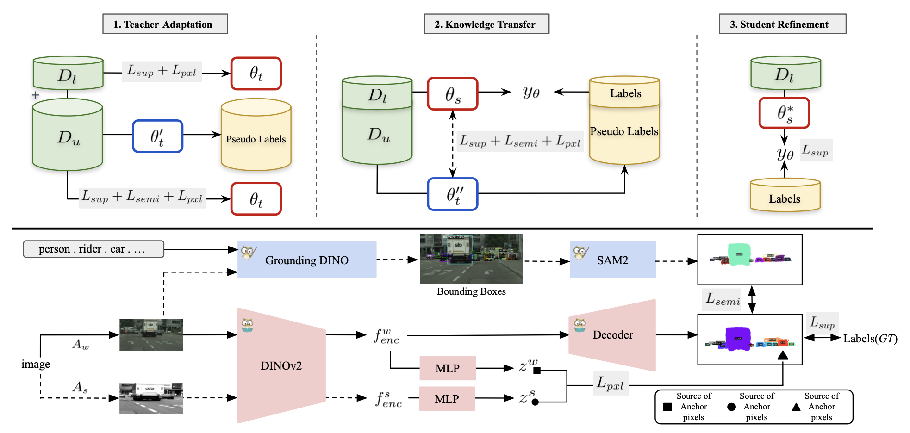

# CAST: Contrastive Adaptation and Distillation for Semi-Supervised Instance Segmentation

> A three-stage pipeline that leverages limited labels and abundant unlabeled data to train a compact student model via contrastive pixel-wise distillation.

---



---

## Overview

CAST is built around three key steps:
1. **Adaptation**  
   Warm up the student on the small labeled set using standard instance-segmentation losses.  
2. **Contrastive Self-Supervision**  
   Pull pixel-level features of positive proposals closer in embedding space, while pushing negatives apart.  
3. **Knowledge Distillation**  
   Transfer instance-level predictions and refined feature representations from a large teacher to the compact student.

This design yields a student model that nearly matches its teacher on standard benchmarks—despite using far fewer parameters and FLOPs.

---

## Citation

If you use this code or ideas from CAST, please cite:

```bibtex
@article{taghavi2025cast,
  title   = {CAST: Contrastive Adaptation and Distillation for Semi-Supervised Instance Segmentation},
  author  = {Taghavi, Pardis and Liu, Tian and Li, Renjie and Langari, Reza and Tu, Zhengzhong},
  journal = {arXiv preprint arXiv:2505.21904},
  year    = {2025}
}
